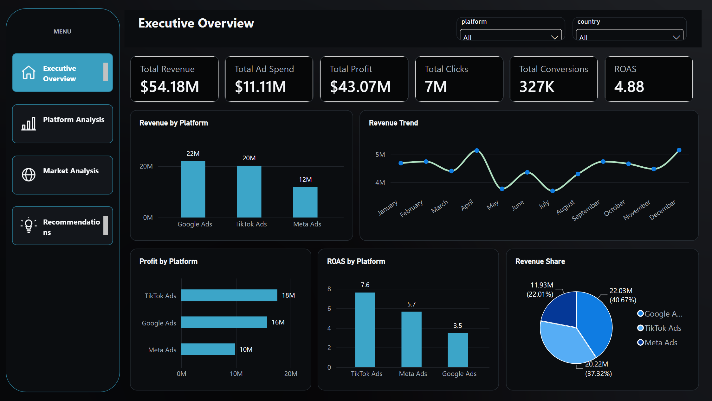
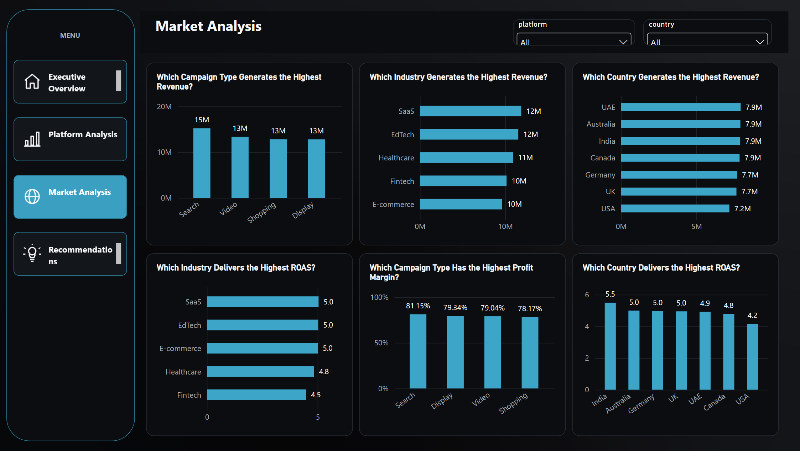
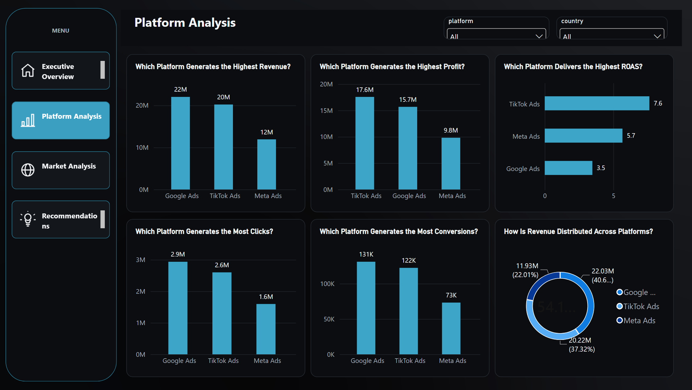
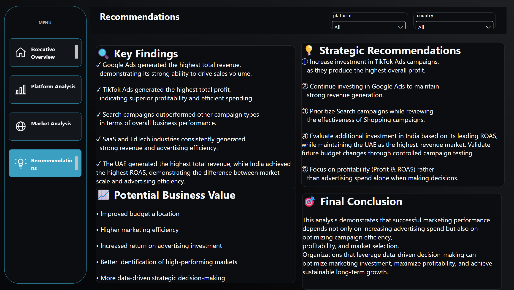

# 🚀 Global Digital Advertising Performance Analysis

> **End-to-End Data Analytics Project using Python, SQL, and Power BI**


---

# 📖 Project Overview

This project presents a complete **Data Analytics workflow** for evaluating digital advertising performance across multiple marketing platforms.

Starting from raw campaign data, the project demonstrates the complete analytics lifecycle:

* Data Understanding
* Data Quality Assessment
* Exploratory Data Analysis
* Feature Engineering
* Executive Business Recommendations
* SQL Business Analysis
* Interactive Power BI Dashboard

The objective is not only to analyze historical performance but also to generate **actionable business insights** that support strategic marketing decisions.

---

# 🎯 Business Objectives

The project aims to answer questions such as:

* Which advertising platform generates the highest revenue?
* Which platform delivers the highest profit?
* Which campaign type performs best?
* Which industries achieve the strongest ROAS?
* Which countries represent the highest-value markets?
* How can marketing budgets be optimized?

---

# 📊 Dataset

The dataset contains campaign-level advertising performance across multiple digital marketing platforms including:

* Google Ads
* Meta Ads
* TikTok Ads

Features include:

* Date
* Platform
* Campaign Type
* Industry
* Country
* Impressions
* Clicks
* CTR
* CPC
* Ad Spend
* Conversions
* Revenue
* ROAS
* CPA

---

# 🛠 Technologies Used

| Category      | Tools            |
| ------------- | ---------------- |
| Programming   | Python           |
| Data Analysis | Pandas, NumPy    |
| Visualization | Matplotlib       |
| Database      | MySQL            |
| Dashboard     | Power BI         |
| Environment   | Jupyter Notebook |

---

# 🔄 Analytics Workflow

```
Raw Dataset
        │
        ▼
01 Data Understanding
        │
        ▼
02 Data Quality Assessment
        │
        ▼
03 Exploratory Data Analysis
        │
        ▼
04 Feature Engineering
        │
        ▼
05 Executive Summary &
Business Recommendations
        │
        ▼
SQL Business Analysis
        │
        ▼
Power BI Executive Dashboard
```

---

# 📂 Repository Structure

```
Global-Digital-Advertising-Performance-Analysis/

│── data/
│     └── global_ads_performance_dataset.csv

│── notebooks/
│     ├── 01_data_understanding.ipynb
│     ├── 02_data_quality_assessment.ipynb
│     ├── 03_exploratory_data_analysis.ipynb
│     ├── 04_feature_engineering.ipynb
│     └── 05_executive_summary_and_business_recommendations.ipynb

│── sql/
│     └── marketing_campaign_business_questions.sql

│── dashboard/
│     └── Global_Digital_Advertising_Performance_Analysis.pbix

│── images/
│     ├── executive_overview.png
│     ├── platform_performance.png
│     ├── market_campaign_analysis.png
│     └── executive_recommendations.png

│── README.md
│── requirements.txt
│── LICENSE
```

---

# 📓 Notebook Overview

## 01 — Data Understanding

* Dataset inspection
* Variable identification
* Data types
* Initial exploration

---

## 02 — Data Quality Assessment

* Missing values analysis
* Duplicate detection
* Data consistency checks
* Quality assessment

---

## 03 — Exploratory Data Analysis

* Revenue analysis
* Platform comparison
* Industry analysis
* Country analysis
* Campaign analysis
* Trend analysis

---

## 04 — Feature Engineering

New business metrics were created including:

* Profit
* Profit Margin
* Conversion Rate
* CPM
* Additional analytical features

---

## 05 — Executive Summary & Business Recommendations

Transforms analytical findings into business recommendations by identifying:

* High-performing platforms
* High-performing campaigns
* Strong geographic markets
* Strategic optimization opportunities

---

# 🗄 SQL Business Analysis

The SQL component contains **20 business questions** solved using MySQL.

Topics include:

* Aggregations
* GROUP BY
* ORDER BY
* Ranking
* Revenue analysis
* Profit analysis
* Platform comparison
* Campaign performance
* Country performance
* Industry performance

---

# 📊 Power BI Dashboard

The interactive dashboard consists of four executive pages:

## 1️⃣ Executive Overview

* Revenue
* Profit
* ROAS
* Clicks
* Conversions
* Revenue Trend

---

## 2️⃣ Platform Performance Analysis

Answers:

* Which platform generates the highest revenue?
* Which platform generates the highest profit?
* Which platform delivers the highest ROAS?
* Which platform generates the most clicks?
* Which platform generates the most conversions?

---

## 3️⃣ Market & Campaign Performance Analysis

Analyzes:

* Campaign Types
* Industries
* Countries
* Profitability
* ROAS

---

## 4️⃣ Executive Insights & Strategic Recommendations

Summarizes the project into actionable business recommendations for decision-makers.

---

# 📸 Dashboard Preview


## Executive Overview



## Platform Performance



## Market & Campaign Analysis



## Executive Recommendations


```

---

# 💡 Key Insights

* Google Ads generated significant revenue.
* TikTok Ads demonstrated strong profitability.
* Search campaigns consistently outperformed other campaign types.
* Certain industries achieved higher advertising efficiency.
* Geographic performance varied considerably across markets.

---

# 🚀 Business Recommendations

* Increase investment in high-performing platforms.
* Prioritize Search campaigns.
* Allocate budget toward top-performing markets.
* Focus on profitability and ROAS rather than spend alone.
* Continuously monitor KPIs to optimize decision-making.

---

# ▶️ Installation

Clone the repository:

```bash
git clone https://github.com/YOUR_USERNAME/global-digital-advertising-performance-analysis.git
```

Navigate into the project:

```bash
cd global-digital-advertising-performance-analysis
```

Install dependencies:

```bash
pip install -r requirements.txt
```

---

# 📈 Skills Demonstrated

* Data Cleaning
* Data Validation
* Exploratory Data Analysis
* Feature Engineering
* SQL Querying
* Data Visualization
* Dashboard Development
* Business Storytelling
* Executive Reporting

---

# 🔮 Future Improvements

* Predictive analytics
* Marketing budget optimization
* Customer segmentation
* Time-series forecasting
* Interactive drill-through dashboards

---

# 👨‍💻 Author

**Saad Maher**

Aspiring Data Analyst passionate about transforming data into actionable business insights through Python, SQL, and Power BI.

If you found this project useful, consider ⭐ starring the repository.
